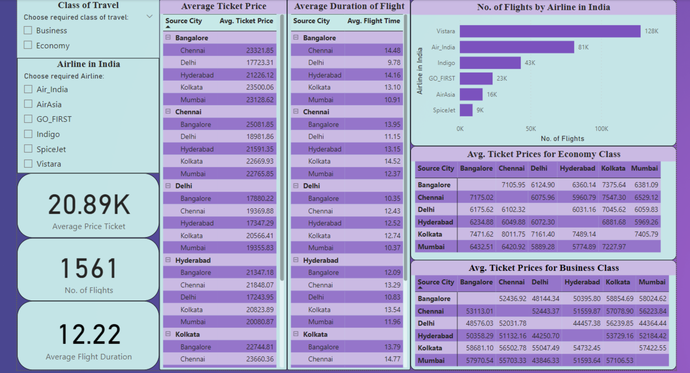
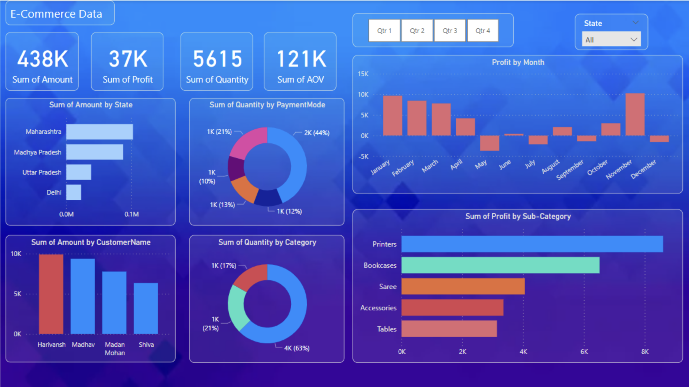
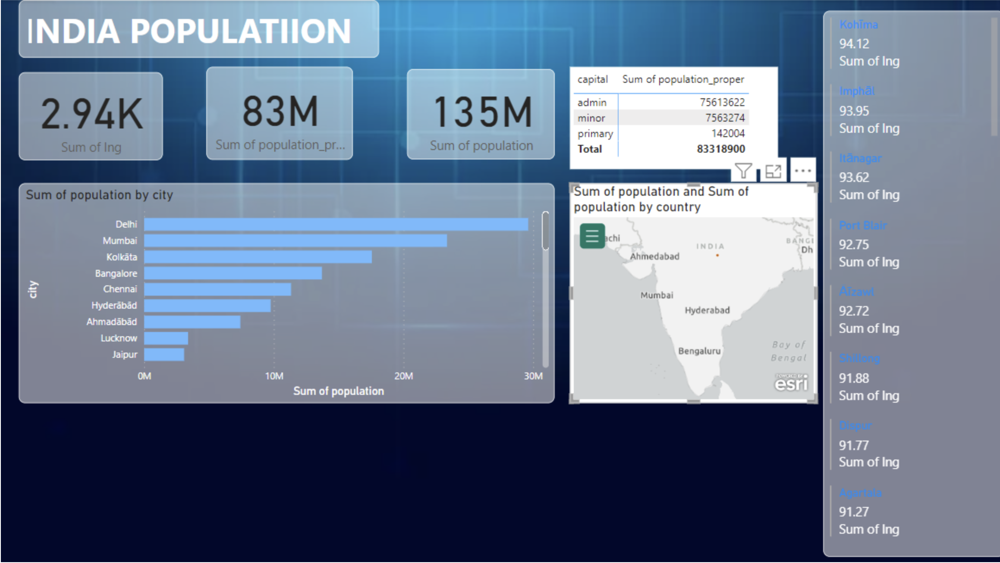
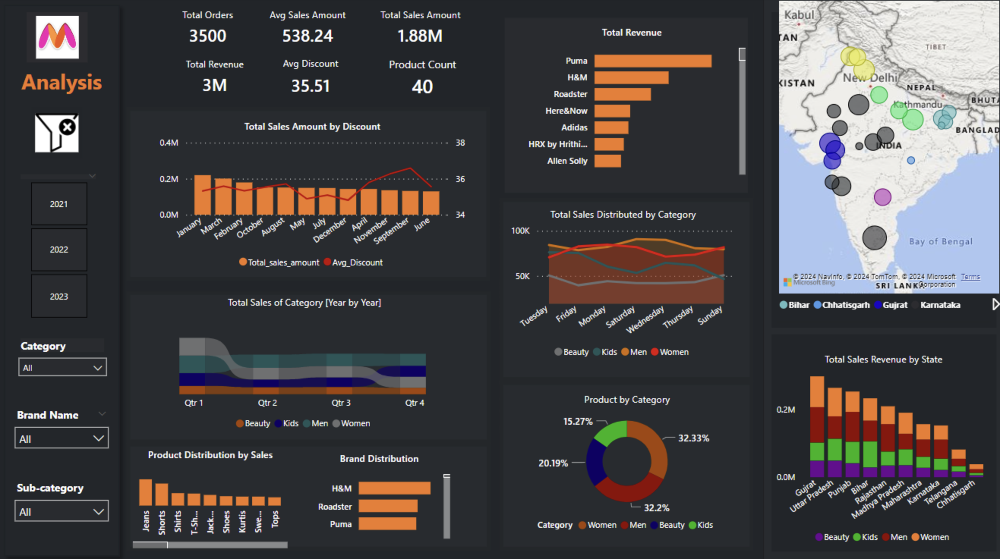
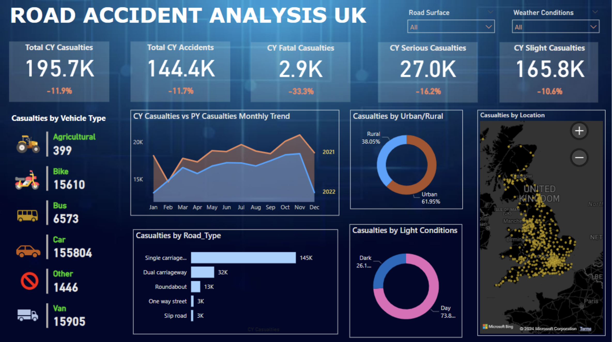
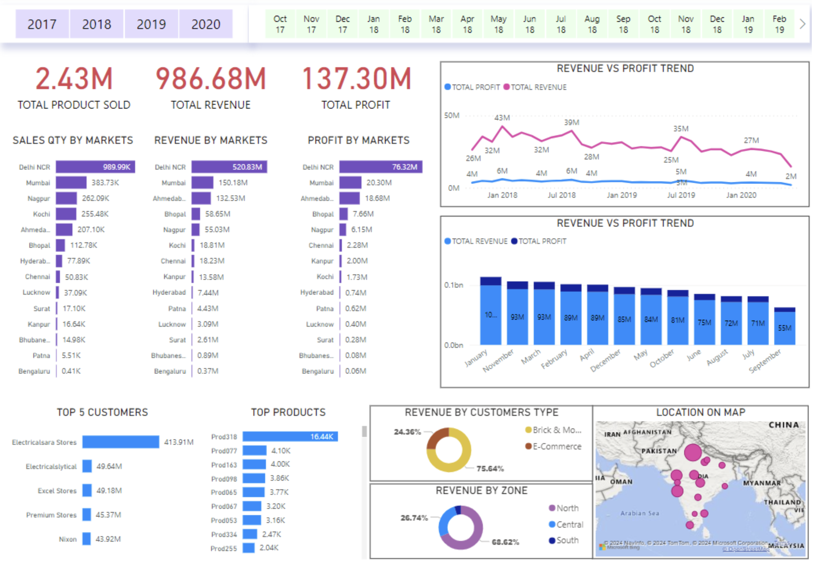

# 📊 Power BI Projects Portfolio

Welcome to my Power BI Projects repository!  
This collection features interactive dashboards built using Power BI to transform raw datasets into compelling visual stories.

---

## 🛫 Indian Airlines Ticket Price Dashboard

**Description:**  
This dashboard analyzes ticket pricing trends across Indian airlines, revealing seasonal pricing strategies and airline-wise comparisons.

---

## 🛍️ E-commerce Sales Insight Dashboard

**Description:**  
A powerful overview of e-commerce metrics like total sales, top-performing products, and customer segmentation insights.

---

## 📈 India Population Dashboard

**Description:**  
Visualizes India's population data across states and genders using Power BI map visualizations, bar charts, and percentage growth insights.

---

## 👕 Myntra Product Dashboard

**Description:**  
A fashion e-commerce dashboard focusing on product analysis, pricing trends, and category performance from Myntra data.

---

## 🚧 Road Accident Analytics Dashboard

**Description:**  
Highlights accident hotspots, vehicle type involvement, time-of-day analysis, and state-wise breakdown of road accident data in India.

---

## 📊 Sales Insights Dashboard

**Description:**  
This dashboard provides a high-level summary of sales performance by region, product line, and trends over time.

---

## 🛠️ Tools & Technologies Used

- **Power BI Desktop**
- **DAX (Data Analysis Expressions)**
- **Power Query**
- **Git & GitHub**
